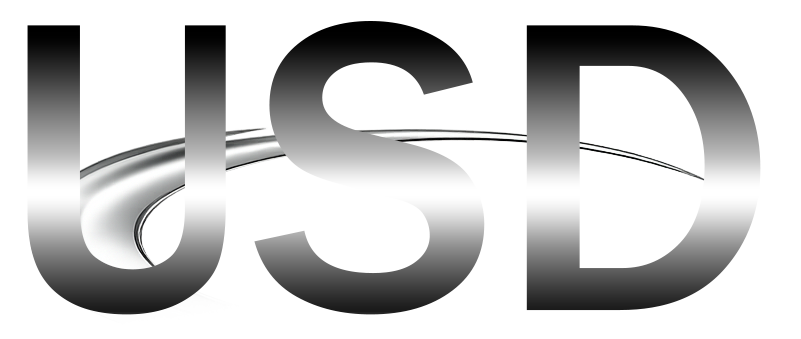
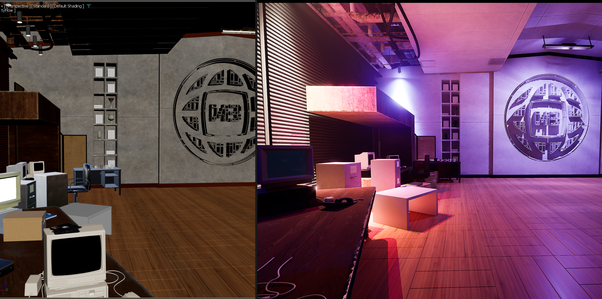
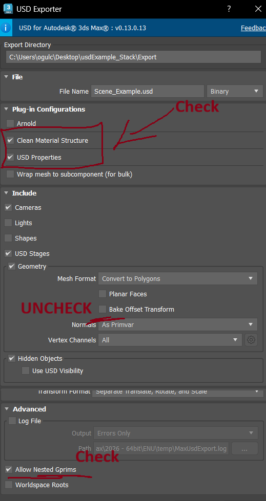

# PowerUSD Exporters



User friendly batch USD exporters for Blender and 3dsmax.

## Repository Layout

| Path | Contents |
|------|----------|
| `3dsmax/` | 3ds Max entry scripts, `cloneTools` helpers, Max icons, and attribute definitions |
| `blender/Clone_PowerUSD/` | Blender add-on package |
| `unreal/` | Unreal Editor Python helpers |
| `unreal/additional/` | Optional Unreal utility scripts |
| `examples/3dsmax/` | Example Max scene |
| `docs/images/` | README screenshots |

## 3ds Max Exporter

USD export with auto stage assembly, variant sets, proxies and prim kind definitions.

### How does it work?

It exports everything to separate .USD file and assembles them. You can use auto-assembly or assembly tool. Please open the example scene to understand how script works better!

Dummy objects with USD properties modifier (can be found in Customize panel) can be used to define prim kinds and more. You can assign this modifier to objects in the scene aswell but there is not much point to it. Groups get converted to dummies due to how horrible 3dsmax group objects are. 

This script tries to be modular as possible! So you don't need to export the whole scene to update over and over again. It comes with single export that doesn't generate hirearchy json.


| Property | Values | Description |
|----------|--------|-------------|
| Geom Type | (auto), Xform, Scope | Prim container type |
| Kind | (none), assembly, group, component, subcomponent, model | USD Kind metadata |
| Purpose | default, render, proxy, guide | Rendering purpose |
| Instanceable | true/false | GPU instancing flag |
| Hidden | true/false | Start invisible |
| Active | true/false | Prim active state |
| Asset Version | string | Version tracking in assetInfo |
| Draw Mode | default, bounds, origin, cards | Viewport draw mode |
| Payload | true/false | Use payload instead of reference |


Filename suffixes are used for defining variants and proxies.

### Filename Suffixes

Object names control assembly behavior through suffixes:

| Suffix | Effect |
|--------|--------|
| `_VARIANT1`, `_VARIANT2`, ... | Assembled into a VariantSet on the parent prim |
| `_RENDER` | Sets `purpose = render` |
| `_PROXY` | Sets `purpose = proxy` |
| `_GUIDE` | Sets `purpose = guide` |
| `_PAYLOAD` | Referenced as payload instead of reference |

### Difference from standard USD export

- Reads USD Properties from Max Attribute Holders and writes them to USD prims
- Strips the `/root` wrapper that MaxUSD adds (can be turned on again)
- Remaps material binding paths
- Handles variant set creation from `_VARIANT*` children
- Nests `/mtl` scope under the content prim for clean referencing

### Material Structure Cleanup

The Clean Material Structure fixes MaxUSD's default material export to produce cleaner USD Preview Surface shaders.

| Clean Off | Clean On |
|-----------|----------|
|  |  |
|  |  |

### 3ds Max Installation

1. Copy `3dsmax/cloneTools/` to:

   ```text
   %LOCALAPPDATA%\Autodesk\3dsMax\2026 - 64bit\ENU\scripts\CloneTools\
   ```

2. Drag the `.ms` entry scripts from `3dsmax/` into the 3ds Max viewport to install:

   ```text
   3dsmax/powerusd.ms
   3dsmax/bulkexporter.ms
   3dsmax/addusdproperties.ms
   3dsmax/reassemble.ms
   ```

3. Optional: copy `3dsmax/icons/powerusd_logo.png` to:

   ```text
   %LOCALAPPDATA%\Autodesk\3dsMax\2026 - 64bit\ENU\usericons\PowerUSD\
   ```

### MAXUSD Settings



Don't export whole scene with animation enabled. Use single export mode and send animated stuff. Use reassembler if needed.

## Blender Exporter

Install `blender/Clone_PowerUSD/` as a Blender add-on. In Blender, use `Edit > Preferences > Add-ons > Install` and select the add-on package.

## Unreal Helpers

Unreal Editor Python scripts live in `unreal/`. Optional one-off utilities live in `unreal/additional/`.

## License

MIT
